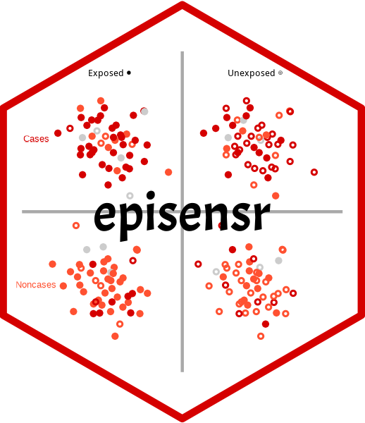

<!-- README.md is generated from README.Rmd. Please edit that file -->

# episensr 

<!-- badges: start -->

[](https://cran.r-project.org/package=episensr)
[](https://ci.codeberg.org/repos/14547)
[](https://doi.org/10.5281/zenodo.5223863)
[](https://www.repostatus.org/#active)
[](https://cran.r-project.org/package=episensr)

<!-- badges: end -->

The R package **episensr** allows to do basic sensitivity analysis of
epidemiological results as described in **Applying Quantitative Bias
Analysis to Epidemiological Data, 2<sup>nd</sup> ed.** by Matthew P.
Fox, Richard F. MacLehose, and Timothy L. Lash ([ISBN:
978-3-030-82672-7](https://link.springer.com/book/10.1007/978-3-030-82673-4),
[bias.analysis](https://sites.google.com/site/biasanalysis/)).

## License

This package is free and open source software, licensed under GPL2.

## Citation

To cite **episensr**, please use:

``` r
citation("episensr")
#> To cite package 'episensr' in publications use:
#> 
#>   Haine, Denis (2025). The episensr package: Basic sensitivity analysis
#>   of epidemiological results. R package version 2.0.0.
#>   https://dhaine.codeberg.page/episensr/. doi: 10.5281/zenodo.4554553.
#> 
#> A BibTeX entry for LaTeX users is
#> 
#>   @Misc{,
#>     title = {The episensr package: basic sensitivity analysis of epidemiological results},
#>     author = {Denis Haine},
#>     year = {2025},
#>     note = {R package version 2.0.0},
#>     doi = {10.5281/zenodo.4554553},
#>     url = {https://dhaine.codeberg.page/episensr/},
#>   }
```

## Example

We will use a case-control study by [Stang et
al.](https://pubmed.ncbi.nlm.nih.gov/16523014/) on the relation between
mobile phone use and uveal melanoma. The observed odds ratio for the
association between regular mobile phone use vs. no mobile phone use
with uveal melanoma incidence is 0.71 \[95% CI 0.51-0.97\]. But there
was a substantial difference in participation rates between cases and
controls (94% vs 55%, respectively) and so selection bias could have an
impact on the association estimate. The 2X2 table for this study is the
following:

|          | regular use | no use |
|----------|-------------|--------|
| cases    | 136         | 107    |
| controls | 297         | 165    |

We use the function `selection` as shown below.

``` r
library(episensr)
#> Loading required package: ggplot2
#> Thank you for using episensr!
#> This is version 2.0.0 of episensr
#> Type 'citation("episensr")' for citing this R package in publications.

selection(matrix(c(136, 107, 297, 165),
                 dimnames = list(c("UM+", "UM-"), c("Mobile+", "Mobile-")),
                 nrow = 2, byrow = TRUE),
          bias_parms = c(.94, .85, .64, .25))
#> 
#> ── Observed data ───────────────────────────────────────────────────────────────
#> • Outcome: UM+
#> • Comparing: Mobile+ vs. Mobile-
#> 
#>     Mobile+ Mobile-
#> UM+     136     107
#> UM-     297     165
#>                                        2.5%     97.5%
#> Observed Relative Risk: 0.7984287 0.6518303 0.9779975
#>    Observed Odds Ratio: 0.7061267 0.5143958 0.9693215
#> ── Bias-adjusted measures ──
#>                                                 
#> Selection Bias Corrected Relative Risk: 1.483780
#>    Selection Bias Corrected Odds Ratio: 1.634608
```

The 2X2 table is provided as a matrix and selection probabilities given
with the argument `bias_parms`, a vector with the 4 probabilities
(guided by the participation rates in cases and controls) in the
following order: among cases exposed, among cases unexposed, among
noncases exposed, and among noncases unexposed. The output shows the
observed 2X2 table, the observed odds ratio (and relative risk) followed
by the corrected ones.

## Installation

You can get the latest release from **CRAN**:

``` r
install.packages('episensr')
```

Or install the development version from
[Codeberg](https://codeberg.org/) with **remotes** package:

``` r
#install.packages("remotes")
remotes::install_git("https://codeberg.org/dhaine/episensr", ref = "develop")
```
